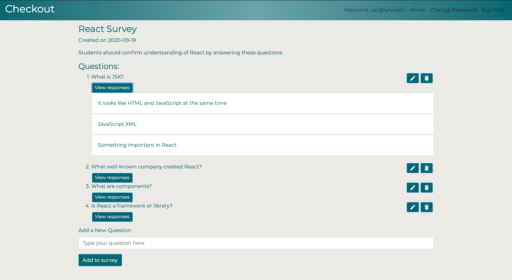

# Checkout Front End
Inspired by weekly exit tickets, checkout is an easy way to make a questionaire to get feedback from students or team members. Anyone can create a survey, but only the survey owner can edit, delete or view responses to the questions. All response submits are final. It is easy to view all of the responses below each question and allows you to quickly guage your audience's feedback.

## Set Up and Installation
1. Fork and clone this repository
2. Install dependencies by running `npm install`
3. Check out to a new branch
4. Open your local repository by running `npm start`

## Important Links
- [API Repo](https://github.com/CjeanHen/checkout_api)
- [Deployed Site](cjeanhen.github.io/checkout_client/)
- [Deployed API](https://checkout-surveys.herokuapp.com)

## Planning Story
I was unsure of how to approach this project at first. When thinking about tables and resources I wasn't sure how much I needed to break down each question. Ultimately, I ended up with a user, survey, question and answer table. Doing this allowed me greater flexibility when thinking of how to retrieve and display data, and in hindsight I think it was the right choice. Since this was my first time working with an SQL database I was worried about the rigidness of the models, but for this project it wasn't a problem as I could easily modify the models throughout my development process. This would not be the case in a large scale application, as there could be negative side effects for the existing data.

The front end was really fun to build. I think I did a good job keeping the components modular, but I think I should revisit the ShowSurvey module and try to break it down even smaller. I feel like I have a strong grasp on the concepts used in this app and am inspired to seek out more advanced understanding and utilization of React. The styling is nothing exceptional, but this is the first independent project in which I attempted to add a personal touch. I think the cleaner websites are more on-brand for me.

## User Stories
As an unregistered user, I would like to sign up with email and password.
As a registered user, I would like to sign in with email and password.
As a signed in user, I would like to change password.
As a signed in user, I would like to sign out.
As a signed in user, I would like to create a survey with a title and questions.
As a signed in user, I would like to update my survey's title and questions.
As a signed in user, I would like to delete my survey.
As a signed in user, I would like to see all surveys and their answers.
As a signed in user, I would like to take a survey.

## Front End Technologies Used
- React (hooks)
- JSX
- JavaScript
- CSS
- Bootstrap

## Unsolved Problems
- I would like to prevent the order of the surveys and questions from changing when edits are made.
- I would like to add a profile page
- I would like to add the respondent's name to each response

## Wireframe
- [Wireframes](https://docs.google.com/presentation/d/e/2PACX-1vTxRf--z_ez1J1ejYtR-HSt4GOGPrsZHefpV-GSHUXUpujRI4ALlj2EkKN3OSUDPTWtNwfDx4iC1d9D/pub?start=false&loop=false&delayms=5000)
